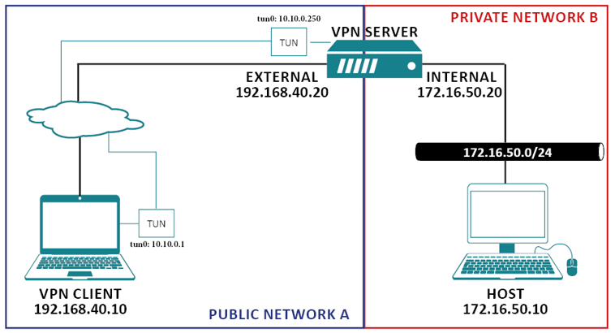

# CNS_VPN_Lab

Lab changed in 2022 to use three containers instead of VM's and no longer assessed.

## Task 1: Lab Setup

Follow the guide to setup the environment. This will download and create three containers.

 - VPN Client, which also acts as a client in the Public Network A - **IP 192.168.40.10**
 - VPN Server, which sits in both Public Network A, and Private Network B - **IP 192.168.40.20 & 172.16.50.20**
 - Host, which is a host in the Private Network B. - **IP - 172.16.50.10**

Docker commands required to log into the machines:

```
docker exec -it vpn_client-192.168.40.10 bash
docker exec -it vpn_server-192.168.40.20 bash
docker exec -it host-172.16.50.10 bash
```


